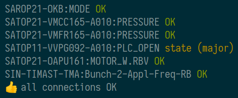
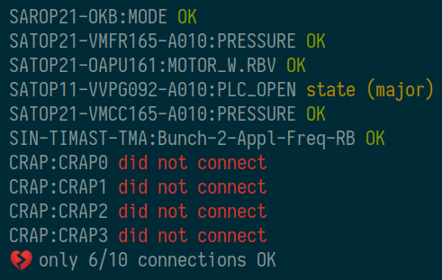
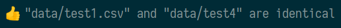
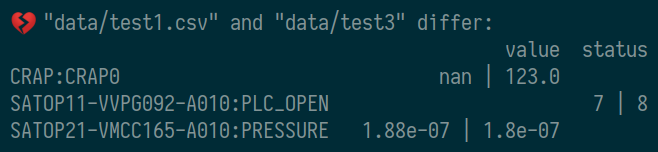

# sanipy

sanipy is a friendly command-line tool for epics connection testing.

It has two commands ([check](#check) and [compare](#compare)), each with a few option switches (described in `sanipy COMMAND -h`).

The `data` folder contains some example channel lists and output files for testing.

## Requirements

- Python 3.6 or later
- [pyepics](https://pyepics.github.io/pyepics/)
- [colorama](https://pypi.org/project/colorama/)
- [numpy](https://numpy.org/)
- [pandas](https://pandas.pydata.org/)

## Installation

sanipy is available from the [PSI anaconda channel](https://anaconda.org/paulscherrerinstitute/sanipy):

```bash
conda install -c paulscherrerinstitute sanipy
```

At PSI, it is already installed in the GFA Python 3.7 environment, which can be accessed via

```bash
source /opt/gfa/python 3.7
```

## Commands

### check

Reads a list of PV names from plain text file (comments starting with `#` are allowed, even recommended) and tests each channel for connection, alarm status and severity.

By default, the connection tests are performed in parallel. For each channel, the result will be printed as soon as it arrived. Thus, the output is ordered by response time. For debugging purposes, the parallelization of the tests can be turned off (`-s`/`--serial`), in which case the output is printed in alphabetical order (note that in serial mode each broken channel has to time out before the next channel is tested, in which case the total execution time can become very long).

There is a command-line switch to suppress the output (`-q`/`--quiet`) and to set the connection time out in seconds (`-t`/`--timeout`).

The test result can be written to a comma-separated values (csv) file by giving a filename to the `-o`/`--output` switch (`.csv` is automatically appended to the filename if missing).

#### example output

`sanipy check data/test_chans_good.txt`
<br>


`sanipy check data/test_chans_bad.txt`
<br>


Successful connections will be marked in green, failed connection in red, and alarm states will be printed in yellow.

### compare

Reads two csv files produced via [check](#check), and prints the differences (if any). Again, `.csv` is automatically appended to the filenames if missing.

Values are, on the one hand, likely to change between checks. However, this change does, on the other hand, not necessarily indicate a problem. Thus, there is a switch (`-v`/`--ignore-values`) to ignore them in the comparison.

#### example output

`sanipy compare data/test1.csv data/test4 --ignore-values`
<br>


`sanipy compare data/test1.csv data/test3`
<br>


Entries that are identical in both files will not be shown. Differences will be printed as `LEFT | RIGHT`.

